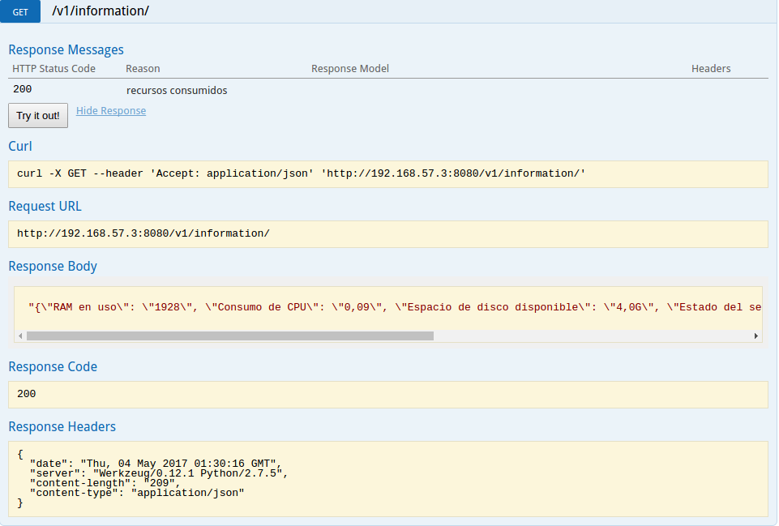

### Ray Torres - A00309856

### Parcial 2 Operativos    

* primero se creo un usuario check_user, por medio del cual se ejecutaron todas las acciones descritas en el contrato.

* Con el objetivo de consultar la informacion correspondiente a  consumo de memoria RAM (por medio de los comandos awk y vmstat), consumo de CPU (por medio de la instalacion de systat y el comando mpstat), espacio disponible en disco(por medio de los comandos awk y df), estado de un servicio de su elección (httpd, sshd, etc)(por medio de los comandos service y awk), en mi caso el servicio sshd, se  creo el siguiente script 'checkCommands.py'.


``` 
from subprocess import Popen, PIPE

def cMemoria():
  vmstat_process = Popen(["vmstat", "-s","-S","m"], stdout=PIPE,stderr=PIPE)
  listado_stats= Popen(["awk", '{print $1}' ],stdin=vmstat_process.stdout, stdout=PIPE, stderr=PIPE).communicate()[0].split('\n')

  print(listado_stats)
  return filter(None, listado_stats)


def cCpu():
  mpstat_process = Popen(["mpstat"], stdout=PIPE, stderr=PIPE)
  awk_process = Popen(["awk", '{print $3}'], stdin=mpstat_process.stdout, stdout=PIPE, stderr=PIPE).communicate()[0].split('\n')

  return filter(None, awk_process)


def cDisco():
        df_process = Popen(["df","-h",'/dev/mapper/cl-root'], stdout=PIPE, stderr=PIPE)
        awk_process = Popen(["awk", '{print $4}'], stdin=df_process.stdout, stdout=PIPE, stderr=PIPE).communicate()[0].split('\n')


        return  filter(None, awk_process)

def eServicio():
        service_process = Popen(["/usr/sbin/service","sshd","status"], stdout=PIPE, stderr=PIPE)
        awk_process = Popen(["awk",'-F' ,'Active:', '{print $2}'], stdin=service_process.stdout, stdout=PIPE, stderr=PIPE).communicate()[0].split('\n')

        return filter(None, awk_process)
``` 
* Para probar que el script estuviese lanzando los datos necesarios, se implemento el siguiente script 'checkDatos.py'
``` 
from flask import Flask, abort, request
import json

from checkCommands import cMemoria, cDisco, cCpu, eServicio

app = Flask(__name__)
api_url= '/v1.0'


@app.route(api_url+'/information', methods=['GET'])
def info():
  list = {}

  list["consumo de RAM"] = cMemoria()[0]
  list["Espacio de disco disponible"]= cDisco()[1]	
  list["Consumo de CPU del usuario"]= cCpu()[2]
  list["Estado del servicio sshd"]= eServicio()[0]
  return json.dumps(list),200


if __name__=="__main__":

  app.run(host='0.0.0.0', port=8080, debug='True')


```
* posteriormente para guardar estos datos en una base de datos sqalchemy,se creo el modelo en un script con la siguiente informacion 'mBase.py'

```
from flask import Flask
from flask_sqlalchemy import SQLAlchemy

app = Flask(__name__)
app.config['SQLALCHEMY_DATABASE_URI'] = 'sqlite:////home/check_user/p2/baseDatos.db'
db = SQLAlchemy(app)


class Modelo(db.Model):
    id = db.Column(db.Integer, primary_key=True)
    cCpu = db.Column(db.String(80), nullable=False)
    cRam = db.Column(db.String(120), nullable=False)
    cDisco = db.Column(db.String(120), nullable=False)
    eServicio = db.Column(db.String(120), nullable=False)


    def __init__(self,cCpu,cRam, cDisco, eServicio):
        self.cCpu = cCpu
        self.cRam = cRam
        self.cDisco = cDisco
        self.eServicio = eServicio

    def __repr__(self):
	informacion = self.cCpu +" " + self.cRam + " " + self.cDisco+ " " + self.eServicio

        return '<informacion %r>' % informacion
```
* despues de tener el modelo listo, se procedio a realizar un script que guardara la informacion en la base de datos 'infoM.py'
```
from mBase import db
from mBase import Modelo
from checkCommands import cMemoria, cDisco, cCpu, eServicio

db.create_all()

info = Modelo(cCpu()[2],cMemoria()[0],cDisco()[1],eServicio()[0] )

db.session.add(info)
db.session.commit()

var=Modelo.query.all()
print(var)
```
* Base de datos funcionando


* Para que el script se consultara los datos de consumo cada 60 segundos se realizo una modificacion en el rontab del usuario check user, mediante el siguiente comando:
```
crontab -u check_user -e
 ```
* En este comando se escriben la siguiente linea:
```
***** python ~/p2/infoM.py
teniendo en cuenta que los 5 asteriscos hacen que el crontab ejecute el script cada minuto
 ```
* para que el script se ejecutara en background se ejecuto de la siguiente manera
```
python infoM.py &
```
* Para la parte de la documentacion en swagger, se realizaron modificaciones en el script inicial, 'checkDatos'
```
from flask import Flask, abort, request
from flask_restplus import Resource, Api
from flask_restplus import  fields
import json

from checkCommands import cMemoria, cDisco, cCpu, eServicio

app = Flask(__name__)


api = Api(app,version='1', title='API EN SWAGGER', description="recursos cpu")
ns = api.namespace('v1/information',description='recursos')
@ns.route('/')

class informacion(Resource):
 @api.response(200,'recursos consumidos')
 def get(self):
  list = {}

  list["RAM en uso"] = cMemoria()[0]
  list["Espacio de disco disponible"]= cDisco()[1]	
  list["Consumo de CPU"]= cCpu()[2]
  list["Estado del servicio sshd"]= eServicio()[0]
  return json.dumps(list),200

 @api.response(404,'HTTP 404 NOT FOUND')
 def post(self):
  return "HTTP 404 NOT FOUND",404


 @api.response(404,'HTTP 404 NOT FOUND')
 def put(self):
  return "HTTP 404 NOT FOUND",404


 @api.response(404,'HTTP 404 NOT FOUND')
 def delete(self):
  return "HTTP 404 NOT FOUND",404


if __name__=="__main__":

  app.run(host='0.0.0.0', port=8080, debug='True')


```
* Funcionamiento API en swagger



